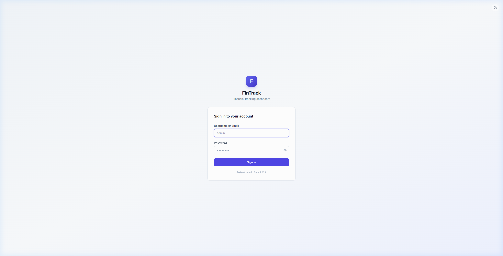
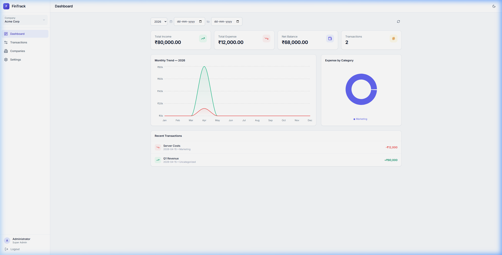

<div align="center">

# 💰 FinTrack

**A self-hosted, lightweight financial tracking dashboard for multiple companies**

[](https://hub.docker.com)
[](https://nodejs.org)
[](https://react.dev)
[](https://sqlite.org)
[](LICENSE)

</div>

---

## ✨ Features

### Core (v0.1.0)
- **Multi-company** — Manage finances across multiple organizations from one dashboard
- **Role-based access** — `Super Admin`, `Admin`, `Manager`, `Viewer` per company
- **Income & Expense tracking** — with categories, tags, and descriptions
- **Bill uploads** — Attach receipts/invoices (images & PDFs, up to 10 MB each)
- **Visual dashboard** — Summary stats, monthly trend charts, expense-by-category donut
- **Filters** — By date range, type, category, tag, or text search
- **Dark / Light mode** — Minimal modern UI with theme persistence
- **100% local** — SQLite database, no external services required
- **Docker-ready** — Single container, runs on any home server

### Report Downloads (v0.2.0)
- **Export PDF** — Color-coded transaction report with summary stats, pdfkit-generated
- **Export CSV** — Spreadsheet-friendly with totals row
- **Bill Preview** — Click any attachment to preview images or PDFs inline (authenticated)
- **Configurable admin** — Set default admin credentials via env vars at first-run

### Inventory & Billing (v0.3.0)
- **Product catalog** — Name, SKU, barcode, unit price, GST rate (0/5/12/18/28%), HSN code, stock
- **Barcode scanning** — Webcam scanner (Quagga2) to look up products instantly
- **Barcode generation** — Display and print barcodes (JsBarcode, CODE128)
- **Invoice builder** — Customer details, line items, intra/inter-state GST toggle
- **GST-compliant invoices** — CGST + SGST (intra-state) or IGST (inter-state), per-slab breakdown
- **PDF invoices** — On-the-fly generation: company header, GSTIN, tax table, totals in INR
- **Invoice lifecycle** — Draft → Issued (auto income transaction) → Paid / Cancelled
- **Stock management** — Auto-decrements on invoice issue for tracked products
- **Company billing profile** — GSTIN, state code, address, phone stored per company

## 📸 Screenshots

| Login | Dashboard |
|-------|-----------|
|  |  |

> Screenshots are from a live running instance. Light mode also available.

## 🚀 Quick Start (Docker)

### Prerequisites
- [Docker](https://docs.docker.com/get-docker/) + [Docker Compose](https://docs.docker.com/compose/)

### 1. Clone & configure
```bash
git clone https://github.com/nomitv/fintrack.git
cd fintrack

# Create your environment file
cp .env.example .env
```

Edit `.env` and set a strong secret:
```env
# Generate a strong secret: openssl rand -base64 48
JWT_SECRET=your-long-random-secret-here
```

### 2. Build & run
```bash
docker compose up -d
```

### 3. Open
```
http://localhost:3000
```

**Default credentials:** `admin` / `admin123`  
> ⚠️ Change the admin password immediately after first login via **Settings → Change Password**.

---

## 🛠️ Development Setup

```bash
# Backend (Express + SQLite)
cd backend
npm install
npm run dev        # Starts on :3000

# Frontend (React + Vite) — in a new terminal
cd frontend
npm install
npm run dev        # Starts on :5173, proxies API to :3000
```

---

## ⚙️ Configuration

All configuration is via environment variables. Set them in `.env` (copied from `.env.example`).

| Variable | Required | Default | Description |
|----------|----------|---------|-------------|
| `JWT_SECRET` | **Yes** | — | Secret for signing JWT tokens. Use `openssl rand -base64 48` to generate. |
| `PORT` | No | `3000` | HTTP port the server listens on |
| `ADMIN_USERNAME` | No | `admin` | Default admin username (first-run only) |
| `ADMIN_PASSWORD` | No | `admin123` | Default admin password (first-run only) |
| `ADMIN_EMAIL` | No | `admin@ledgerengine.local` | Default admin email (first-run only) |
| `ADMIN_NAME` | No | `Administrator` | Default admin display name (first-run only) |
| `CORS_ORIGINS` | No | _(empty)_ | Comma-separated allowed origins. Leave empty for same-origin only. |
| `DATA_DIR` | No | `/app/data` | Directory for SQLite database file |
| `UPLOAD_DIR` | No | `/app/data/uploads` | Directory for uploaded bill attachments |

---

## 🏗️ Architecture

```
fintrack/
├── Dockerfile              # Multi-stage build (Alpine frontend → Slim backend)
├── docker-compose.yml      # Single-container deployment
├── .env.example            # Environment variable template
├── backend/
│   ├── server.js           # Express app entry point
│   ├── database.js         # SQLite schema + seeding (better-sqlite3)
│   ├── middleware/
│   │   └── auth.js         # JWT authentication + RBAC middleware
│   └── routes/
│       ├── auth.js         # Login, register, user management
│       ├── companies.js    # Company CRUD + user assignment
│       ├── transactions.js # Transaction CRUD, categories, tags, attachments
│       └── dashboard.js    # Analytics: summary, monthly trend, by-category
└── frontend/
    ├── vite.config.js
    └── src/
        ├── api.js          # Axios-based API client
        ├── context/        # AuthContext, ThemeContext
        ├── components/     # Layout, Sidebar, TopBar, StatCard
        └── pages/          # Login, Dashboard, Transactions, Companies, Settings
```

**Tech stack:**
- **Frontend:** React 18, Vite, Tailwind CSS, Recharts, Lucide Icons, JsBarcode, Quagga2
- **Backend:** Node.js, Express.js, better-sqlite3, JWT, bcryptjs, multer, pdfkit
- **Database:** SQLite (single file, no server required)
- **Container:** Docker multi-stage build (~380 MB image)

---

## 📦 Releases

| Version | Highlights |
|---------|------------|
| `v0.3.0` | Inventory & Billing module — products, barcode scan/gen, GST invoicing, PDF |
| `v0.2.0` | Report download (PDF/CSV), bill preview modal, configurable admin |
| `v0.1.0` | Initial release — transactions, dashboard, RBAC, Docker, security hardening |

---

## 🔐 Security

- All passwords are hashed with **bcrypt** (cost factor 10)
- All API endpoints require **JWT authentication** (except `/api/auth/login`)
- **Role-based access control** enforced at both global and per-company level
- File uploads restricted to **images and PDFs only** (MIME type allowlist)
- **Path traversal protection** on attachment serving (basename sanitization + DB ownership check)
- **No secrets in the Docker image** — `JWT_SECRET` must be provided at runtime
- SQLite database stored in a Docker volume, never exposed externally
- `docker compose` requires `JWT_SECRET` to be explicitly set (fails fast if missing)

---

## 👤 User Roles

| Role | Create Company | Manage Users | Add Transactions | View Only |
|------|:--------------:|:------------:|:----------------:|:---------:|
| Super Admin | ✅ | ✅ | ✅ | ✅ |
| Admin | ✅ | ✅ | ✅ | ✅ |
| Manager | ❌ | ❌ | ✅ | ✅ |
| Viewer | ❌ | ❌ | ❌ | ✅ |

---

## 🗄️ Data Persistence

All data is stored in a named Docker volume (`fintrack-data`):

```bash
# Backup
docker run --rm -v fintrack_fintrack-data:/data -v $(pwd):/backup \
  alpine tar czf /backup/fintrack-backup.tar.gz /data

# Restore
docker run --rm -v fintrack_fintrack-data:/data -v $(pwd):/backup \
  alpine tar xzf /backup/fintrack-backup.tar.gz -C /
```

---

## 📄 License

MIT — see [LICENSE](LICENSE) for details.

---

<div align="center">
Built with ❤️ for home server enthusiasts
</div>
